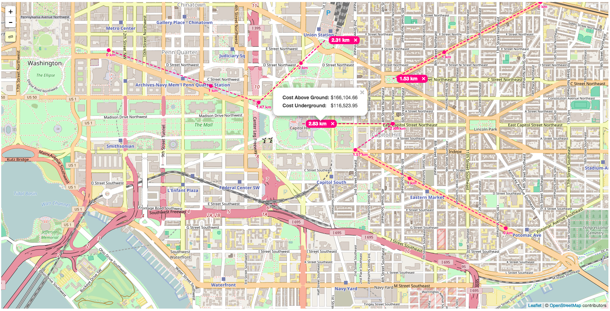

<h2>Leaflet Linear Measurement Plugin</h2>

<ul>

  <li>This plugin is a measuring tool that shows interval marks along the polyline path.</li>

  <li>A tooltip at the end of the last segment indicates the total distance of all segments in a polyline.</li>

  <li>It is possible to create multiple polylines on the same map.</li>

  <li>Double click event will complete the creation of a polyline and allow the creation of a new polyline.</li>

  <li>The polylines can be individually removed from the map.</li>

</ul>

<h2>Demo</h2>

See the <a href="https://NLTGit.github.io/Leaflet.LinearMeasurement/">demo</a>.

  

<h2>Usage</h2>

  
LinearCore is a control class that holds several plugins to interact with the map. You need to just add an instance to the map with a config object:

  
  
Include the script and css

  <pre>
    map.addControl(new L.Control.LinearMeasurement({
        unitSystem: 'imperial',
        color: '#FF0080',
        type: 'line'
    }));
  </pre>

  
There is the possibility to extend the plugin to handle some of the internal events: 

<code>
    var Core = L.Control.LinearCore.extend({
        onSelect: function(e){
            if(!e.total){
              return;
            }

            var distance = e.total.scalar;

            if(e.total.unit === 'mi'){
                distance *= e.sub_unit;

            } else if(e.total.unit === 'km'){
                distance *= 3280.84;

            } else if(e.total.unit === 'm'){
                distance *= 3.28084;
            }

            var cost_underground = 12.55,
                cost_above_ground = 17.89,
                html = [
                    '<table>',
                    ' <tr><td class="cost_label">Cost Above Ground:</td><td class="cost_value">${total_above_ground}</td></tr>',
                    ' <tr><td class="cost_label">Cost Underground:</td><td class="cost_value">${total_underground}</td></tr>',
                    '</table>'
                ].join(''),
                numberWithCommas = function(x) {
                    return x.toString().replace(/\B(?=(\d{3})+(?!\d))/g, ",");
                };

            var data = {
                total_above_ground: numberWithCommas(L.Util.formatNum(cost_above_ground * distance, 2)),
                total_underground: numberWithCommas(L.Util.formatNum(cost_underground * distance, 2))
            };

            if(e.rulerOn){
                var content = L.Util.template(html, data),
                    popup = L.popup().setContent(content);

                e.total_label.bindPopup(popup, { offset: [45, 0] });
                e.total_label.openPopup();
            }
        }
    });

    map.addControl(new Core({
      unitSystem: 'imperial',
      color: '#FF0080',
      type: 'line'
    }));</code>

<h2>Options</h2>

<table>
  <tr><th>option</th><th>default</th></tr>
  <tr><td>position</td><td>topleft</td></tr>
  <tr><td>color</td> <td>#4D90FE</td></tr>
  <tr><td>fillColor</td> <td>#fff</td></tr>
  <tr><td>type</td> <td>node</td></tr>
  <tr><td>features</td> <td>['node', 'line', 'polygon', 'ruler', 'paint', 'drag', 'rotate', 'nodedrag', 'trash']</td></tr>
  <tr><td>pallette</td> <td>['#FF0080', '#4D90FE', 'red', 'blue', 'green', 'orange', 'black']</td></tr>
  <tr><td>dashArrayOptions</td> <td>['5, 5', '5, 10', '10, 5', '5, 1', '1, 5', '0.9', '15, 10, 5', '15, 10, 5, 10', '15, 10, 5, 10, 15', '5, 5, 1, 5']</td></tr>
  <tr><td>fill</td> <td>true</td></tr>
  <tr><td>stroke</td> <td>true</td></tr>
  <tr><td>dashArray</td> <td>5, 5</td></tr>
  <tr><td>weight</td> <td>2</td></tr>
  <tr><td>opacity</td> <td>1</td></tr>
  <tr><td>fillOpacity</td> <td>0.5</td></tr>
  <tr><td>radius</td> <td>3</td></tr>
  <tr><td>unitSystem</td> <td>imperial</td></tr>
  <tr><td>doubleClickSpeed</td> <td>300</td></tr>

</table>

<h2>Requirements</h2>
Leaflet 1.0.0+ (may work with earlier versions)

<h2>Author</h2>
New Light Technologies, Inc. (NLT)
Contact us for more informaiton: https://newlighttechnologies.com/about/contact/

